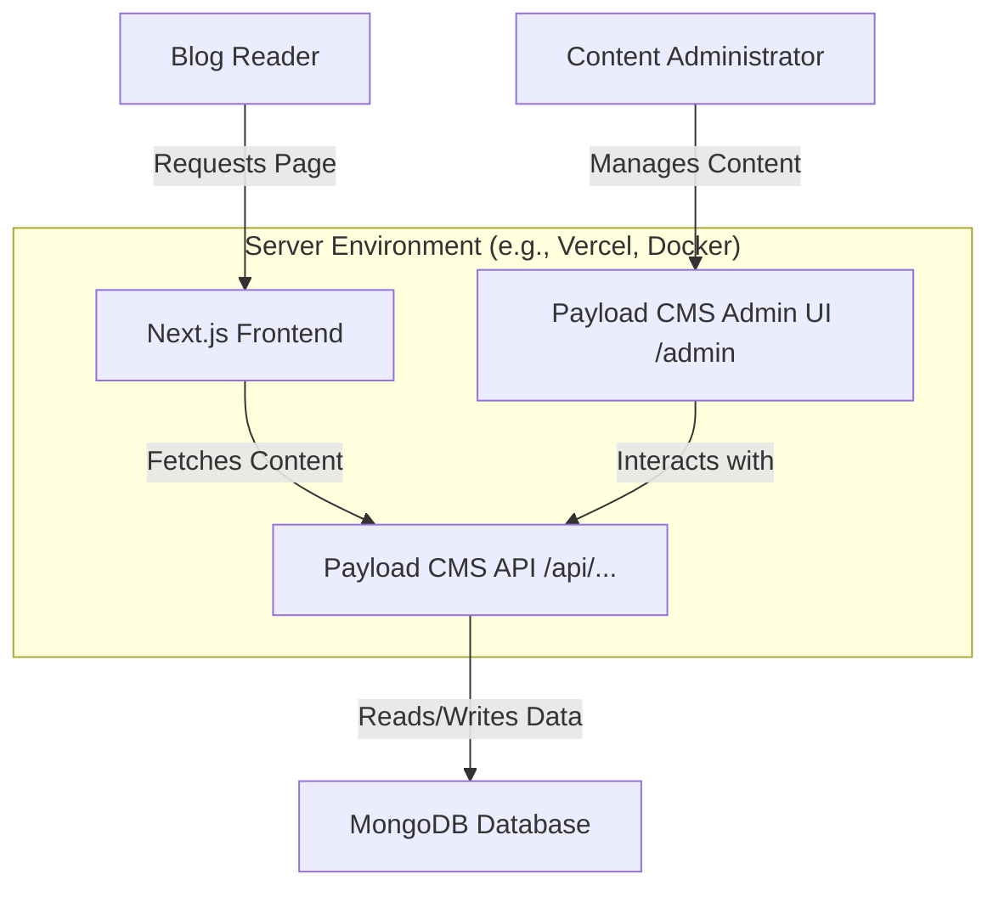

# System Patterns: Rafey Blog

## 1. System Architecture

Rafey Blog employs a **monolithic repository (monorepo)** approach housing both the **headless CMS (Payload CMS)** and the **frontend application (Next.js)**. While co-located, they operate with a clear separation of concerns, characteristic of a headless architecture.

*   **Payload CMS (Backend)**:
    *   Serves as the content repository and management interface.
    *   Exposes content via RESTful and GraphQL APIs (auto-generated).
    *   Handles data persistence (MongoDB via `mongooseAdapter`).
    *   Manages user authentication and authorization for content management.
    *   Runs within the Next.js application structure, typically under a specific path prefix for its admin UI (e.g., `/admin`) and API endpoints (e.g., `/api`).

*   **Next.js (Frontend)**:
    *   Consumes content from Payload CMS APIs.
    *   Renders the public-facing blog website.
    *   Utilizes Next.js App Router for routing and server/client components.
    *   Handles frontend-specific logic, styling (Tailwind CSS), and user interactions.

## 2. Key Technical Decisions

*   **Integrated Monorepo**: Choosing to keep both Payload and Next.js in the same repository simplifies development setup, build processes, and potentially deployment, especially when using platforms that support this structure well (like Vercel for Next.js).
*   **Payload CMS as Headless CMS**: Provides robust content modeling, a customizable admin UI, and powerful APIs out-of-the-box, reducing the need to build these from scratch.
*   **Next.js App Router**: Leverages modern React features, server components for performance, and a flexible routing system.
*   **TypeScript**: Enforces type safety across the entire stack, improving code quality and maintainability.
*   **Tailwind CSS**: Utility-first CSS framework for rapid UI development and consistent styling.
*   **Lexical Rich Text Editor**: Offers a highly extensible and modern rich text editing experience within Payload.
*   **Plugin-Based Architecture for Payload**: Utilizing plugins like `plugin-seo`, `plugin-form-builder`, etc., extends CMS functionality without bloating the core.

## 3. Design Patterns & Conventions

*   **Headless CMS Pattern**: Decoupling the content management backend from the presentation layer (frontend).
*   **Model-View-Controller (MVC) - Loosely Applied**:
    *   **Model**: Payload collections and globals define the data structure and interact with the database.
    *   **View**: Next.js components render the UI based on data fetched from Payload.
    *   **Controller**: Payload API route handlers and Next.js API routes/server actions manage requests and business logic.
*   **Component-Based Architecture (React/Next.js)**: UI is built as a composition of reusable components.
*   **Server Components & Client Components (Next.js App Router)**:
    *   Server Components are used for fetching data and rendering static parts of the page on the server, improving performance.
    *   Client Components (`'use client'`) are used for interactive UI elements that require browser APIs or React hooks like `useState` and `useEffect`.
*   **Utility-First CSS (Tailwind CSS)**: Styling is applied directly in the HTML/JSX using utility classes.
*   **Configuration-as-Code (Payload CMS)**: Collections, globals, fields, and hooks are defined in TypeScript files, allowing for version control and programmatic management of the CMS schema.
*   **Environment Variables**: Configuration (database URIs, secrets) is managed through environment variables (`.env` file).
*   **API-Driven Content**: The frontend primarily interacts with the backend through APIs for all content needs.

## 4. Component & Data Flow Relationships

### Content Creation & Management Flow:
1.  **Admin User** interacts with **Payload Admin UI** (e.g., `src/app/(payload)/admin`).
2.  Payload Admin UI makes requests to **Payload API Endpoints** (e.g., `src/app/(payload)/api/[...slug]/route.ts`) to create/update content (e.g., a Post in the `Posts` collection defined in `src/client/collections/Posts.ts`).
3.  Payload API, using its **MongoDB Adapter**, persists data to the **MongoDB Database**.

### Content Consumption Flow (Frontend):
1.  **Blog Reader** requests a page (e.g., a blog post) from the **Next.js Frontend** (e.g., a dynamic route like `src/app/(frontend)/posts/[slug]/page.tsx`).
2.  The Next.js page component (likely a Server Component) fetches data from the **Payload API Endpoints** (e.g., `/api/posts?where[slug][equals]=my-post-slug`).
3.  Payload API retrieves data from **MongoDB**.
4.  The Next.js component receives the data and renders the HTML, which is sent to the Blog Reader's browser.
5.  Client Components on the page may hydrate and become interactive.

### Key Component Relationships:

*   **Payload Collections (`src/client/collections/`)**: Define the structure of data (e.g., `Posts`, `Pages`, `Users`). They are central to how data is stored and retrieved.
*   **Payload Blocks (`src/client/blocks/`)**: Reusable content structures (e.g., `ContentBlock`, `MediaBlock`) that can be embedded within rich text fields or as standalone layout components. These allow for flexible page building.
*   **Next.js Page Components (`src/app/(frontend)/...`)**: Responsible for fetching data for a specific route and rendering the main content area.
*   **Shared UI Components (`src/client/components/`)**: Components like `RichText.tsx` (for rendering Lexical output), `Button.tsx`, `Card.tsx` are used across both the frontend and potentially within custom Payload admin UI elements.
*   **Payload Globals (`src/client/globals/`)**: Define site-wide settings like `Header.ts` and `Footer.ts`, which are fetched and rendered on most frontend pages.
*   **`payload.config.ts`**: The central configuration file that ties together all Payload collections, globals, plugins, and adapters.
*   **`next.config.mjs`**: Configures Next.js behavior, including rewrites or redirects that might be relevant for integrating Payload's admin UI and API.

## 5. Authentication & Authorization

*   **Payload CMS Users Collection**: Manages users who can log into the Payload admin panel. This is typically defined in `src/client/collections/Users.ts`.
*   **Access Control**: Payload provides fine-grained access control functions at the collection and field level, determining who can create, read, update, or delete content.
*   **Admin Bar**: The `@payloadcms/admin-bar` plugin provides a visual indicator and quick links for authenticated admin users viewing the live frontend site.

This system is designed for flexibility, allowing content structures and frontend presentation to evolve independently while maintaining a strong, integrated development experience.